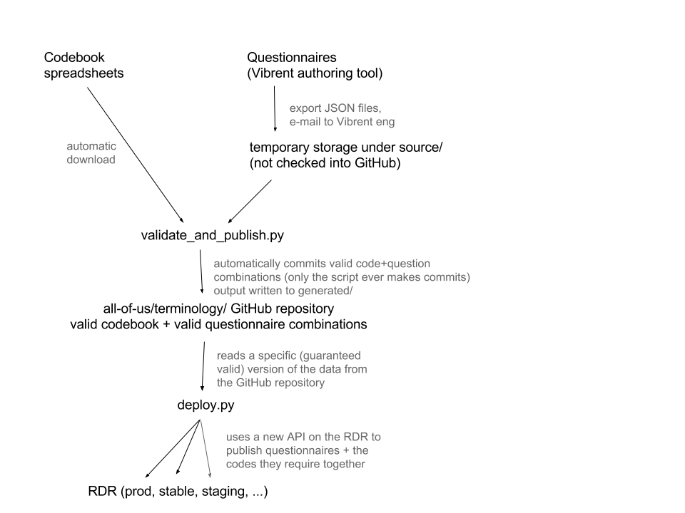

# All of Us Terminology

Codesystems, questionnaires, and validation tools for them, for the All of Us
project.

## One-Time Setup

```shell
virtualenv venv
. venv/bin/activate
pip install -r requirements.txt
```

## Usage



1.  Export questionnaires from Vibrent's authoring tool and place them in
    `source/`.
1.  Activate virtualenv (see above).
1.  `tools/validate_and_publish.py [--commit]` writes to `generated/`.
1.  `git push`
1.  `tools/deploy.py all-of-us-rdr-stable [--version asdf123]`.

Run any command with `--help` for usage details, or with no arguments to try out
default, safe behavior.
